# Devnagri

Devnagri, an AI powered human translation platform is at the clientele service to help businesses reach the potentially huge client base in indian market. Below given is the useful manual that will help in understanding the functionalities of the system. User shall follow the steps to place the order for translation

## Getting Started With Devnagri
On the homepage of the website “www.devnagri.com” there is an option of “Order Now”. By clicking on the option user will be redirected on the order page. 

### Placing an order - Step 1
In the order page there are few details that the user has to fill in order to get the content translated. 

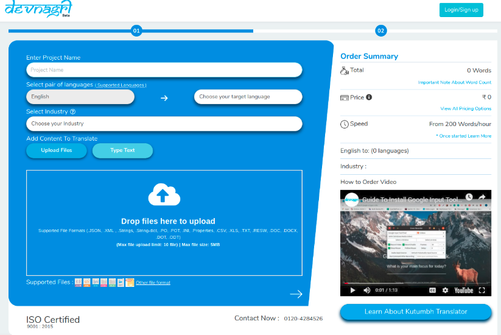

#### Enter Project Name
Choose a relevant project name for the translation order. This can relate to the company, date, or other factors with user could remember it in future

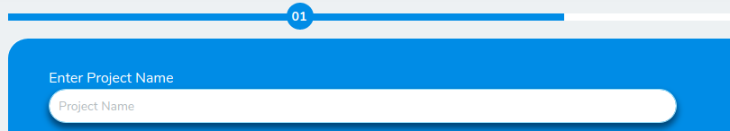

#### Select Pair of Languages
There will be a combination of languages available for translation. User can select more than one language and can get translation in multiple languages in a single order. User will be given the choice where Source Language will be English and target language can be multiple.

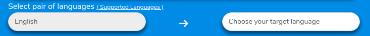

#### Select Industry
User need to select the industry specification to which the content is related. It helps Devnagri AI to assist better. Also industry wise glossary feature is available in Devnagri which depends on this selection.

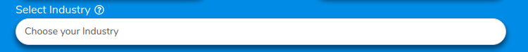

#### Add Content To Translate
User has the choice to either upload files or type text the content. Multiple files  (Upto 10 files with maximum file size of 5Mb) can be uploaded at Devnagri in different formats. We accept 22 different file formats.

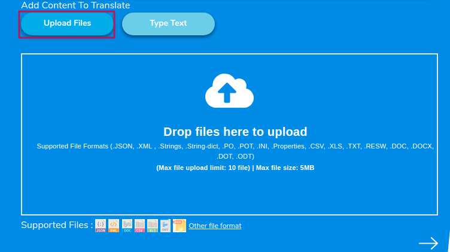

 User can select the option of “Type text” and insert the content directly if required. After the file or content gets accepted kindly select the Arrow button to progress on next step.

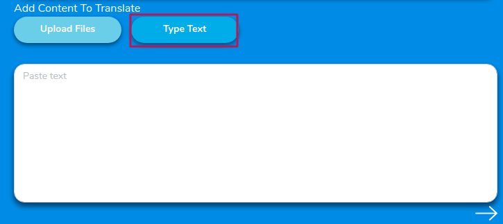

### Placing an Order - Step 2
User need to fill the options under Project Brief after completing step 1 to get the order accepted at Devnagri.

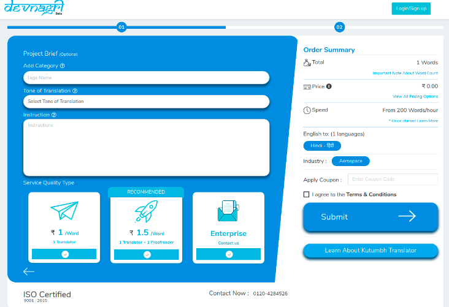

#### Add Category
Add a category to organise the order, if the user has multiple orders than the categorization will help in organizing them better.

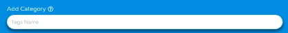

#### Tone of Translation
Select the level of politeness to target the right audience and to get the correct translation as per the requirement.

#### Instruction
The added details about the order are provided in this section. User need to add all the specific details regarding the instruction.

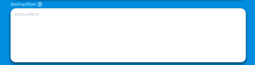

#### Service Quality Type
Choose the translation service pricing package according to the requirement. There are different packages according to the service provided. 
Package One
User will get certified translators of the designated category. The accuracy rate will remain 78%.
Package Two
User will get certified translators & reviewers of the designated category. The accuracy rate will remain 95%.

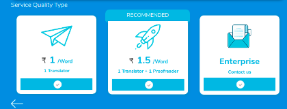

###  Order Summary
On the right side of the order page will be the Order Summary, in this section details such as word count, language and total payable amount will be shown.

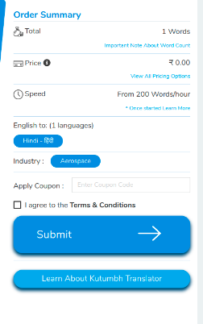

#### Total Word
The total number of words will be shown after calculation from written or uploaded files.

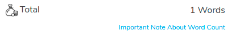

#### Price
Price distribution according to selected package and languages will be shown under this option. The complete details will be mentioned for the billing amount including the taxes.

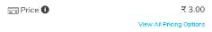

#### Speed
It shows the generic speed at which our translators work. This speed helps in calculation of the order delivery which can be tracked online. This counter for the time starts only after the acceptance of order by the translator.

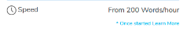

#### English To
All the languages selected for translation are shown under this section. User can check whether all the languages are selected or not.

#### Industry
Here, the industry of the order is shown as per the uses choice while building the order.

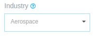

#### Apply Coupon
Any offer coupon available with the user can be applied here. This will help to get a discount on the billing amount as per current offers. User need to agree with “Terms & Conditions” after reading the details by selecting the checkbox given.

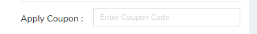

#### Total Amount
The actual billable amount after applying coupon is shown for final billing. User can select the option of “Pay” and can make the payment with internal credits or through different payment gateways. Before payment user will be required to Signup/Signin.

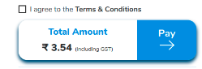

### NOTE: User need to signup/signin before giving.

### Signing Up

User can [sign-up](https://app.devnagri.com/login), by filling the details required (such as Name, Company, Industry, Email ID, Mobile Number, Password) in the form given on the link. Once the complete details are filled, select “sign-up” option, a verification link will be emailed. Log in the registered email and click on the verification button to get account verified.
User can also sign-up using his/her LinkedIn, Google Plus or GitHub ID.

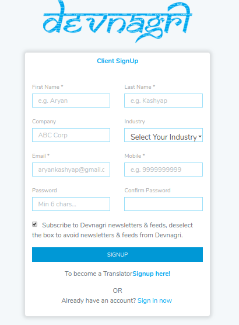

### Logging In

1. User can [login devnagri](https://app.devnagri.com/login) by using credentials (EMail ID & password) made during the sign-up process.

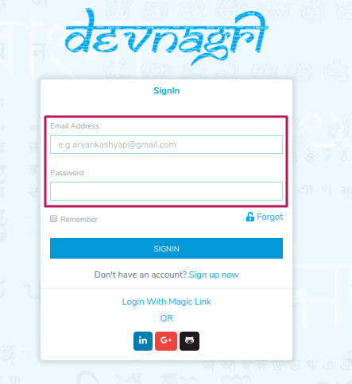

2. User can also login using his/her social media (Linkedin, Google Plus or GitHub) credentials.

3. User can also login using “Magic Link” option, using it user shall enter the registered email ID in the given text box and a unique link shall be emailed on the same ID using which he/she can login directly.

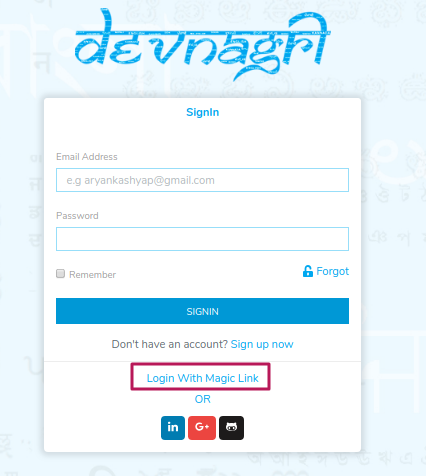

### Password Recovery

If user has forgotten (or want to reset)  the registered password, then using [“Forgot Password”](https://app.devnagri.com/login) option given on login screen it can be renewed (or reset). Enter the registered Email ID, a reset password link will be emailed. Click on that link and enter new password. User will be notified on the successful change of the password.

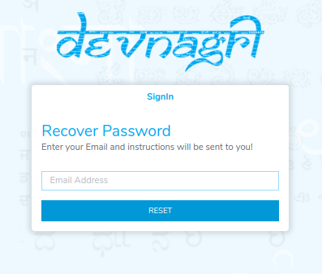

### Payment
After signUp/SignIn user will be redirected to the payment gateway, where the amount for the order can be paid using different methods such as netbanking, debit card, credit card etc.

### Adding Glossary
This works in two ways, user can either add the words manually or can add a file with all the words to be added in glossary. The glossary at Devnagri is updated on the industry basis, it automatically gets embedded in all the orders from the same industry background of the user. On the navigation panel user will find the “Order” menu, select it, go to the “Glossary” tab. In “Add Glossary” option the user can choose between Manual &  Upload.

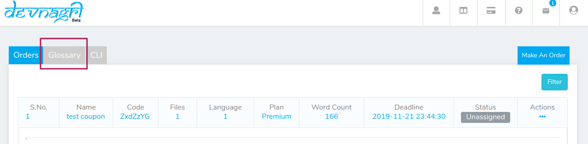

### Manual Glossary
i. Add the “Industry”, select according to the order and terminology

ii. “Term” add the term/word

iii.“Description” is used to add details for the term added. It helps if the translation is required but in a specialized way,

iv.“Translate Term” Select or Deselect; on selecting the option terminology will be translated according to the given instructions & on deselecting the word will remain untranslated. 

v. Use “Save” option to store the terms in glossary.

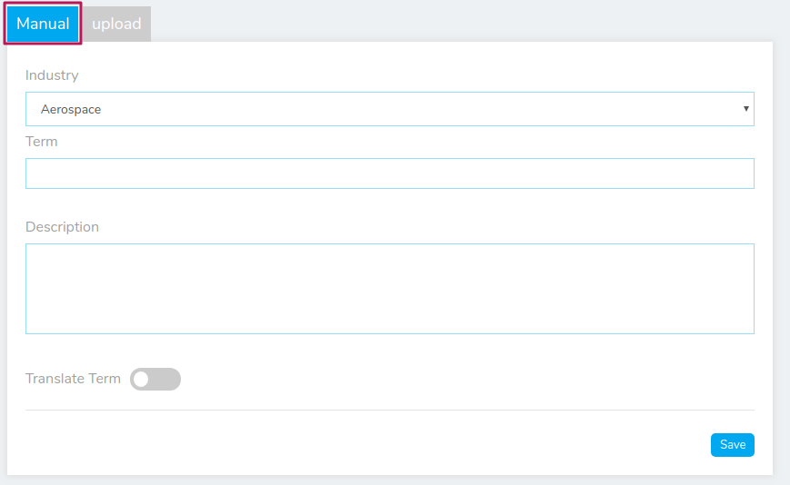

### Upload Glossary
i. To understand how to upload the terms in bulk user can “Download Sample File”. Add the term, description, and the status of translation in “Yes/No”

ii. After the information is added in the file and saved, choose the “Industry”.

iii. Upload the file by simple “drag and drop” or selecting the local file destination. 

iv. As soon as the file gets successfully uploaded select “Save” option.

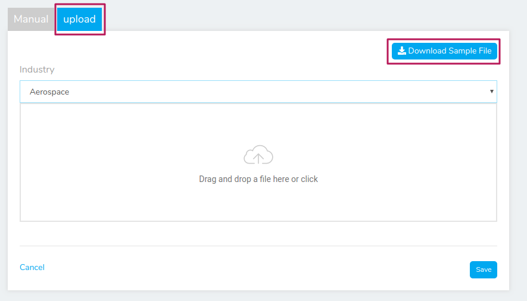

### Order Status
To check the order status user need to find the “order” menu in the navigation panel. On the landing page the order list will be available with all the details. The “Status” option will be showing the current status of the order. The different statuses can be:

1. Processing:
This status remain till the file is completely processed and is ready for translation.

2. Unassigned:
This status indicates that translators are yet to be assigned for the order.

3. Not Paid:
In case of transaction failure or unpaid order this status is shown. User can pay by selecting option from “Action” tab.

4. Assigned:
Once the translator is assigned the project status becomes “Assigned”

5. Pending Review:
If the user chose the option to get the review along with translation then this “Pending Review” status arrives after the completion of translation.

6. Client Review:
Client has to check the order once it has been completed from Devnagri end. Until the client gives approval the “Client Review” status appears.

7. Completed:
After the client marks the order as completed the status is changed to “Completed”

8. Archived:
User can archive the order completed or the order not required. User can use option from “Actions” tab

### Actions
For the project statuses shown there are different actions that user can take, these are:

1. Translate:
To check the current progress of translation, user can choose the option of translate. User can also review the translation and accept the work by using this option.

2. Archive:
User can archive any project using this option. The archived project will be removed from translation process but will be available in the user dashboard.

3. Download
User can download all the files of the order with translated content using this option. The files will be available with the format of the original uploaded file.

4. Pay
For unpaid or for the orders having transaction issues this option can be chosen. It gets removed from the order for which the user has already paid.

## User Dashboard

User dashboard holds all the information about the number of projects ordered, translation status, profile, bill etc.. Below given are the details for the use of different options.

### Navigation Panel

Navigation panel, available options are explained below;

#### Profile

Top-right corner has a profile section that includes User Name and registered Email address below which there are:

1. Account Settings:
It holds different functionalities to improve personal profile, read details.

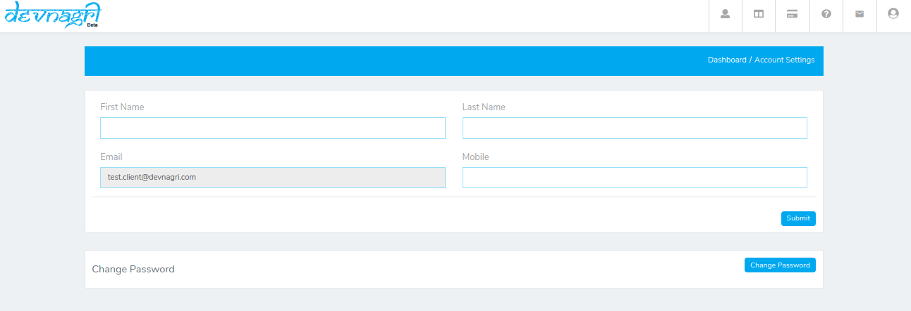

2. Billing Details:
Information such as Billing Address, GSTIN are stored here,

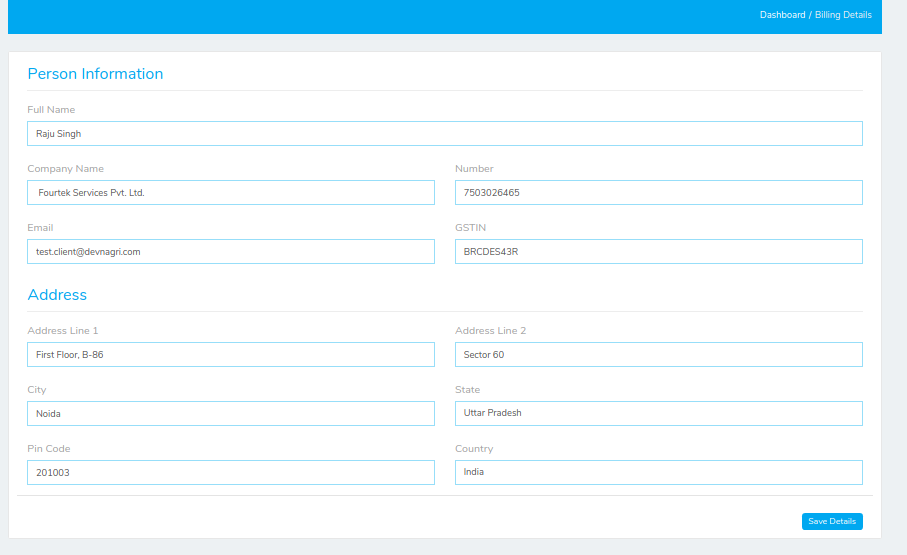

3. Logout To end the current session user can use **Logout** option.

#### Notifications

This tab shall blink whenever any new event happens with the project. For example; when the translator submit the project for review.

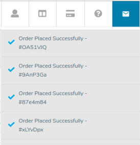

#### Orders

Using this menu user can check out all the orders (current and previous) along with payment status.

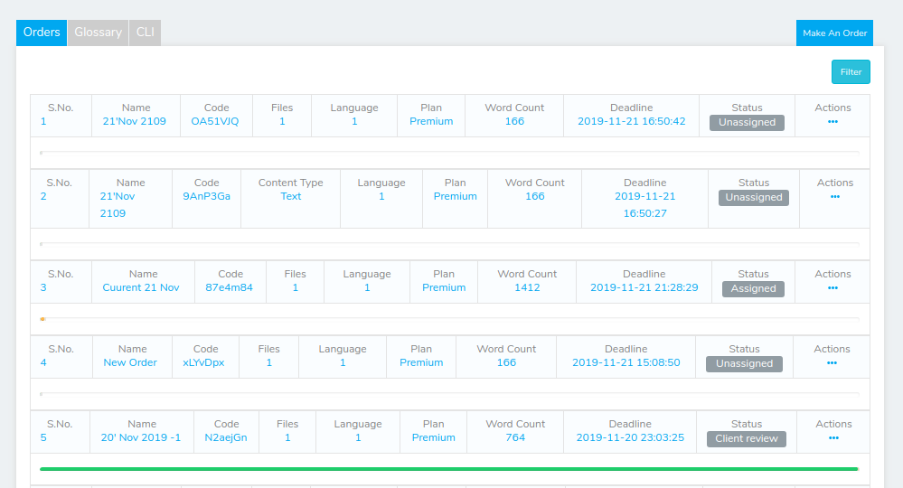

#### Transactions

It holds information about all the transactions made by user for the orders made.

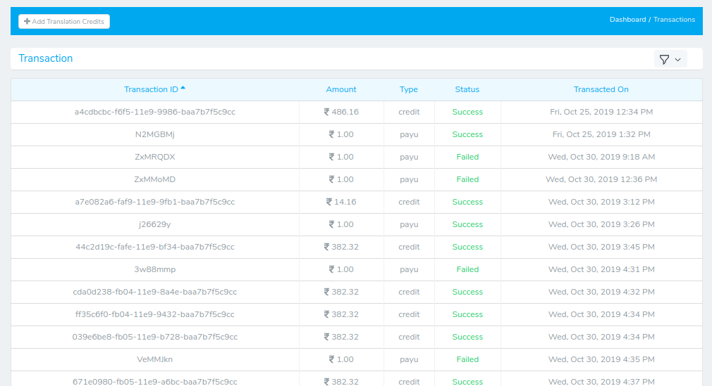

### Client Dashboard

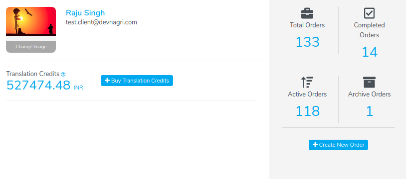

#### Add Picture

User can add a profile photo for display purpose using this option. User can upload a file from local disk.

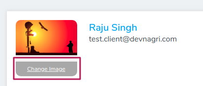 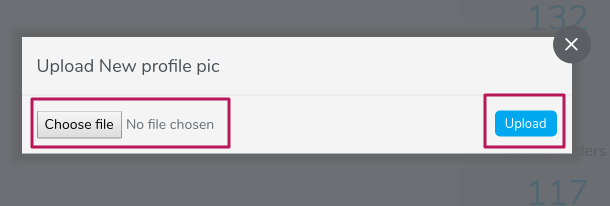 

#### Translation Credits

This is a premium service wallet that will hold the balance amount for the user interested in getting a manual translator/Proof-reader for the project.

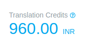

#### Buy Credits

Using this option, client will be able to buy [Translation Credit](#TC) credits in the account.
