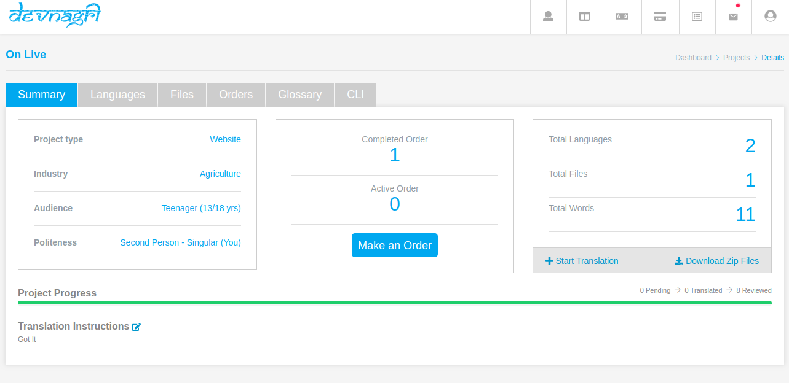
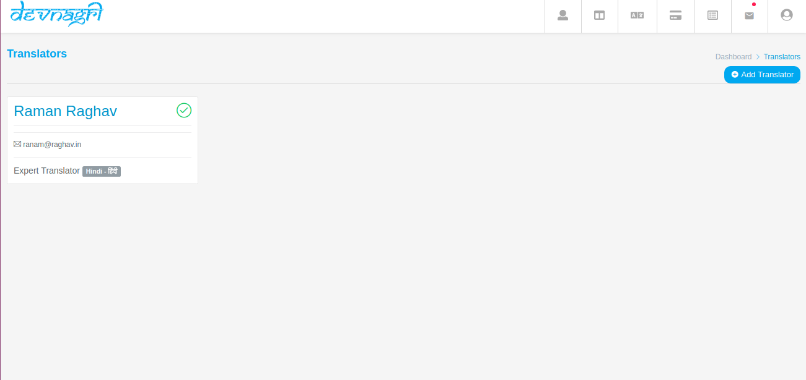
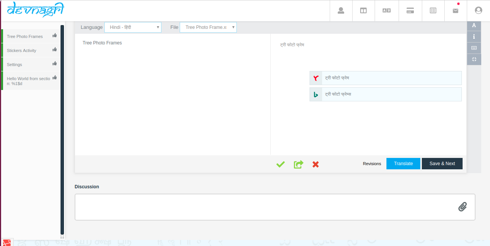

# Create Project

Devnagri is a unique localization platform which is capable of providing translation services in a power-packed combo of A.I. and human Expertise.

The steps here will help on the use of our platform -

# Step 1: Logging into the Devnagri tool

[Log in to the platform.](https://app.devnagri.com)

# Step 2: User Dashboard

After logging in, all the information of projects & Credits is displaying on User Dashboard.

# Step 3: Add New Project

 Click on **Add New Project** to create a new Project and fill up the following fields related to the project:

 Click on **Add New Project** to create a new Project and fill up the following fields related to the project:

- Project Name
- Platform
- Industry
- Audience
- Level Of Politeness
- Source language
- Target Language
- Instruction

# Step 4: Upload File

The file upload process is the same for all Localization formats concerning Web and Mobile applications. For example - `js`, `po` etc.

# A. Upload a String or XML file for Translation

Our System will automatically extract the text that needs to be translated from your files (i.e String .xml).

# B. Update the file

Upload an updated file with the same file format as previous and our system will automatically detect the added/ removed words accordingly.

We support the following file formats :

1. **JSON**
2. **XML**
3. **PHP**
4. **Strings**
5. **String dict**
6. **PO**
7. **POT**
8. **INI**
9. **Properties**
10. **CSV**
11. **XLS**
12. **TXT**
13. **RESW**
14. **RESX**

# Step 5: Order Selection

There are three plans in an Order Selection:

1. **Free** -In here, you will be allowed to do the translation on your own or add your own translation.

2. **Automated Translation(AT)** -  This will give you an option of choosing suggestions from Google, Yandex and Bing.

3. **Premium** - In the premium version, we will provide a domain expert or translator along with a reliable proofreader.

# Step 6: Order

You can place the order by choosing from the following options -

- **Select All**.
- **Specific file**.
- **Date Range**.
- **Last Order Option**.

Also, you can make an order by specifying the non-translated sentences.

# Step 7: Proofreading

There is an option to choose Proofreading with which you will get a Domain expert translation reviewer.

# Project Details

After creating a project you will see the complete details of your project with their status.

# Start Translation

You can translate your strings by using automatic suggestions or do the same manually.

# **Set up your own Localization Team**

# Add Translator

 You can add your own translators for your projects. **Translators** > **Add Translator**

  

  You can communicate and give guidelines to translators by commenting on individual phrases at discussions.

  
