# Devnagri

A dedicated community to connect lingual experts globally as Kutumbh by Devnagri. It helps to resolve any query and in getting mentorship from experts. Not only it improves translation skills but also gives an opportunity to earn limitless with the quality work in the same field. Below given is the guide for translator to join Devnagri & start earning.

## Getting Started As Translator

### Signing Up

Translator (Further, can be termed as “Translator”or “User”) can join the community either by using the [link](https://kutumbh.devnagri.com/) or else by clicking “**Become a Translator**” button given on top of the [home page](https://www.devnagri.com/). 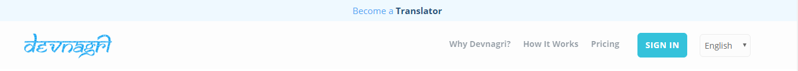

1. Add Language pair with proficiency level, Domain expertise and choose “Next” option  
2. Select the Terms & Condition checkbox and choose"Next" option 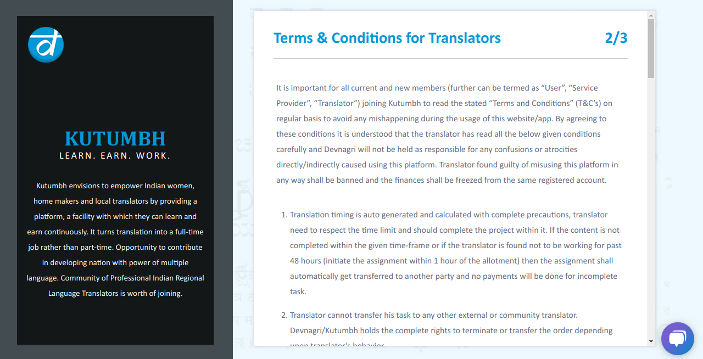
3. Fill the form with the appropriate details and choose “Finish” option  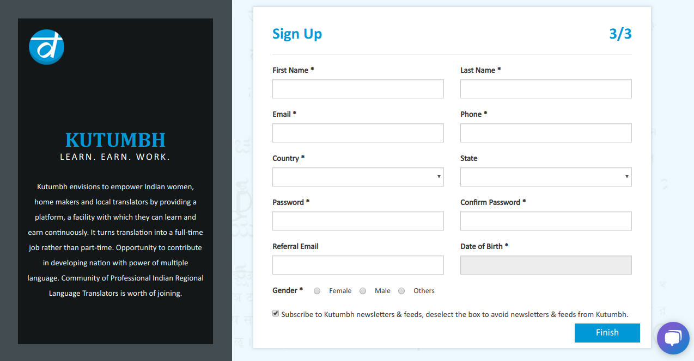
4. Success message will be displayed.

### Log In

1. User can [login devnagri](https://app.devnagri.com/login) by using credentials (EMail ID & password) made during the sign-up process
2. User can also login using his/her social media (Linkedin, Google Plus or GitHub) credentials .
3. User can also login using “Magic Link” option, using it user shall enter the registered email ID in the given text box and a unique link shall be emailed on the same ID using which he/she can login directly.

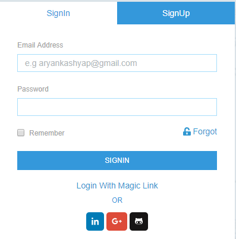

### Password Recovery

If user has forgotten (or want to reset)  the registered password, then using “Forgot Password” option given on login screen it can be renewed (or reset). Enter the registered Email ID, a reset password link will be emailed. Click on that link and enter new password. User will be notified on the successful change of the password. 

## Translator Dashboard

Translator dashboard is the landing screen after the login, it will display all the vital info about the order and profile of the translator.

### Navigation Panel

Navigation panel, available options are explained below;
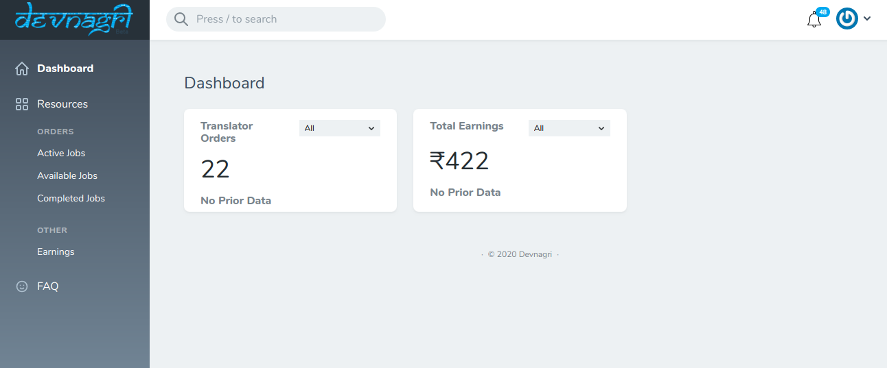

1. **Profile**: It is the first option on top-right corner of the screen. This option will navigate to account settings, profile, guide and will help to log out from current account.

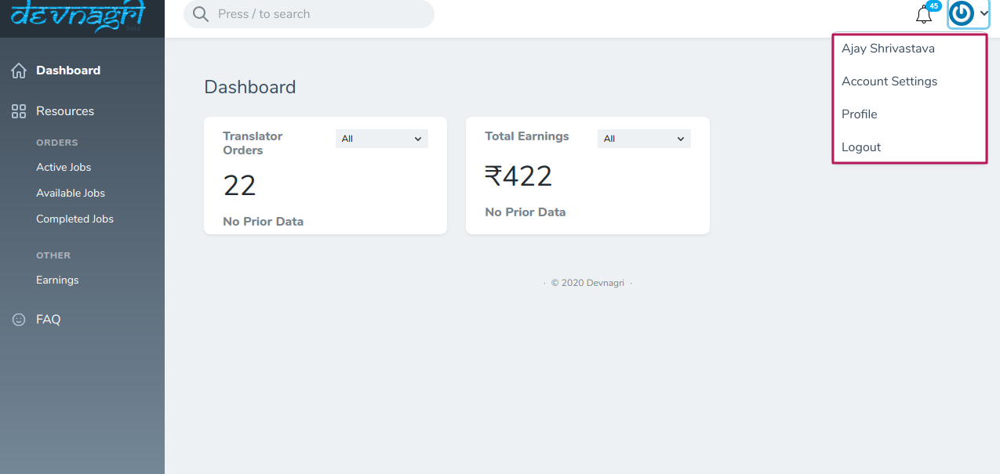

2. **Notification**: This option higlights any new update important for translator. Once click on any notification user will redirect to actual screen.

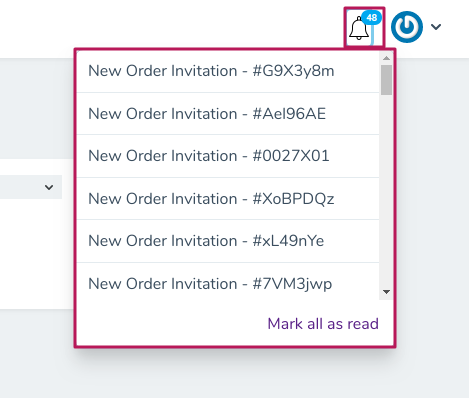

3. **Available Jobs**: All the new orders should be displayed in available jobs screen.

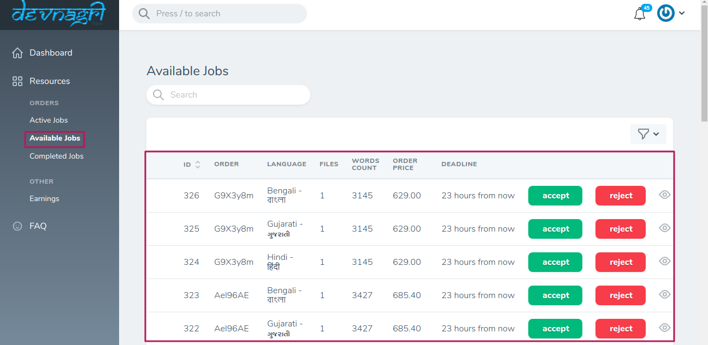

Order Detail

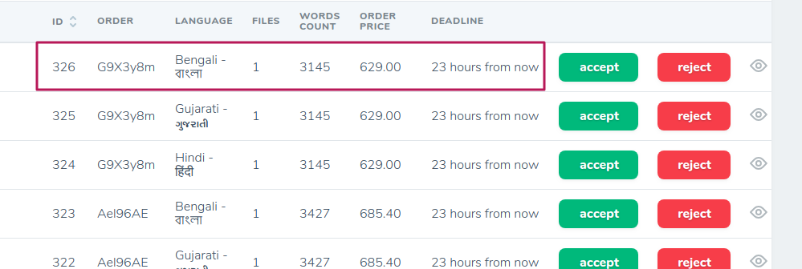

Translator should **Accept** the order by click on accept button. After accepting, that order will reflect on Active Jobs screen.

or

 Transltor can **Reject** the order aswell. After rejecting, that order will not reflect to translator.

 4. **Active Jobs**: All the accepted orders will be displayed on Active jobs screen.

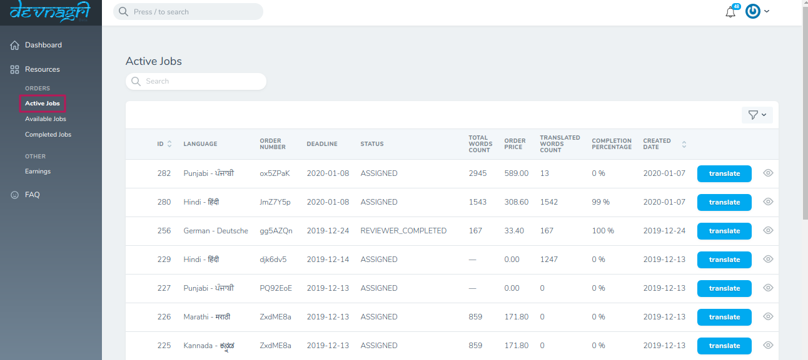

Translator can start their job by clicking on **Translate** button

5. **Completed Jobs**: All your orders accepted by client will be displayed on Completed Jobs.

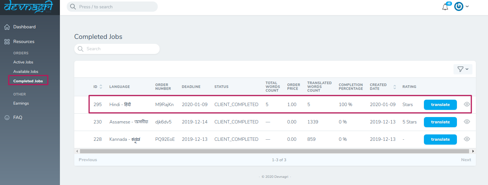

6. Earnings: Using this option user can check all the updates for standing and paid amounts.

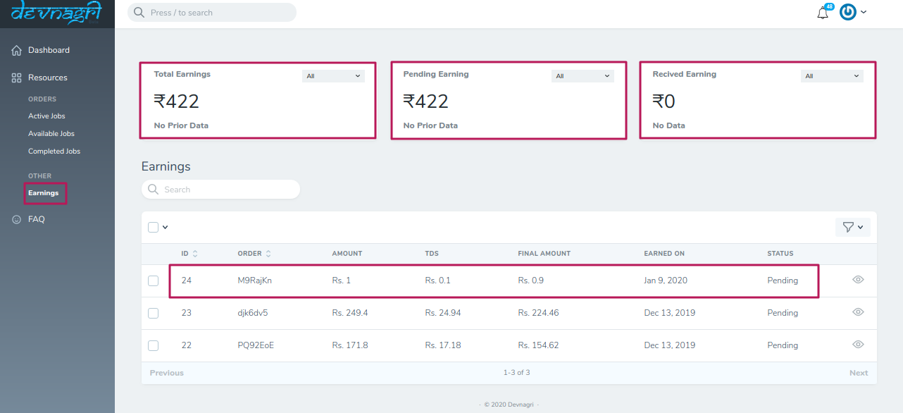

### Edit Profile

Translator should edit his profile before moving forward. Selecting this option will land to the page holding tabs as described below:

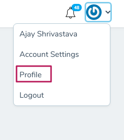

1. General Info: Upload a Picture, Edit personal information such as Name, number etc. Then give short description about your past experience in “About Me” section. Next, “Add Address” if not added earlier or if you want to change it. User can also add the educational qualification under “Education” section given further below. If user has any certifications or achievements related to the translation field then he can mention the same in “Certificate & Achievements”. “Save” the info edited and move to the next tab.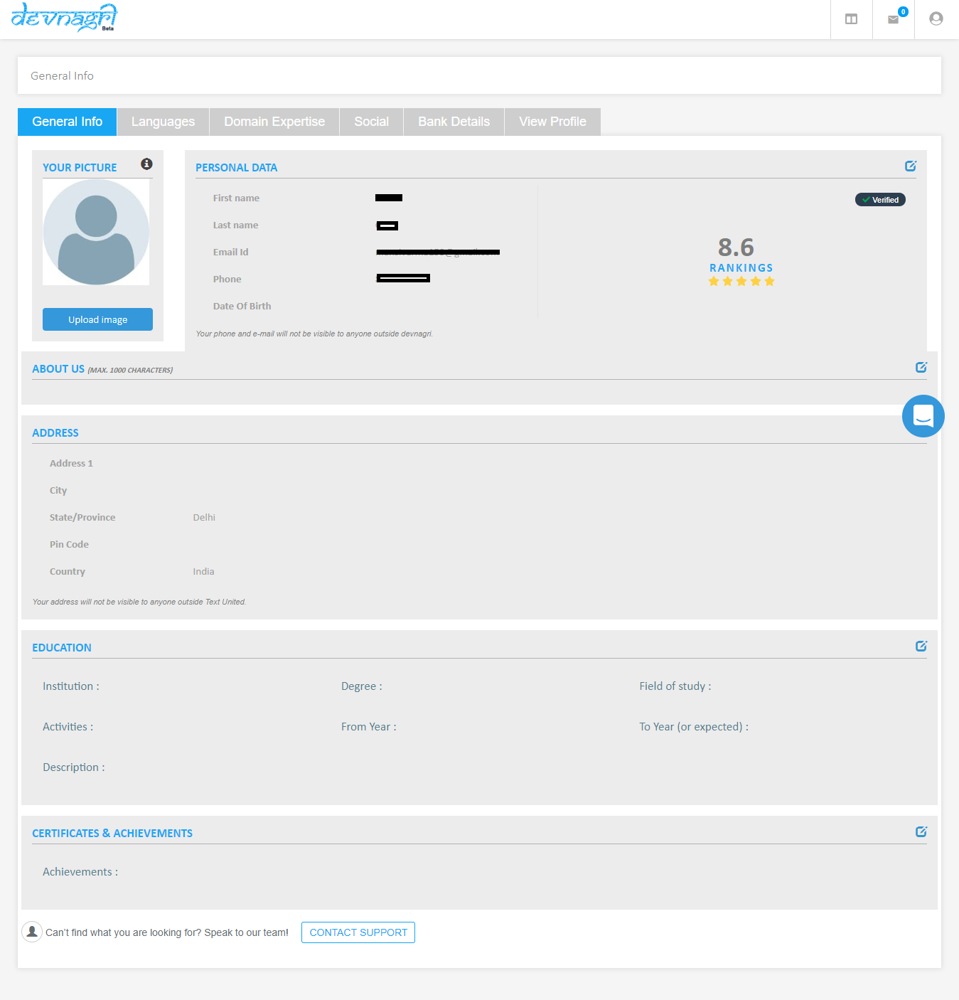
2. Languages: Here, user will find the language added at the time of Sign-up. User can add more languages using the button “Add More Languages” under this tab, also user can choose to “Take Test” if the language is added recently using the option “Actions”. User can also “Deactivate” the verified language using same “Actions” option. Save the details as per the choice. Status will show the updates in a particular language as activated, not verified or deactivated.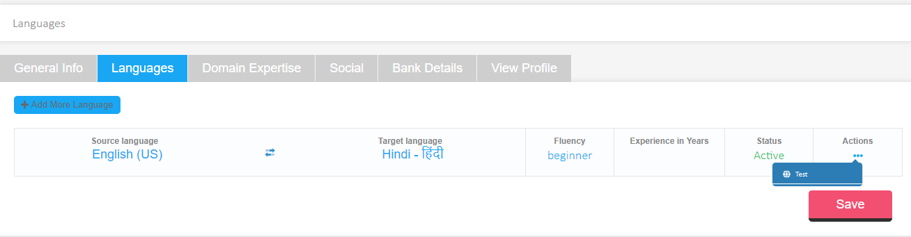
3. Domain Expertise: This option helps the translator to add the field he is expert in, for translation purpose. User can add multiple fields depending upon the knowledge, there is no upper cap. User can also remove the domain using option under “Actions”. Use “Save” button to confirm the choices.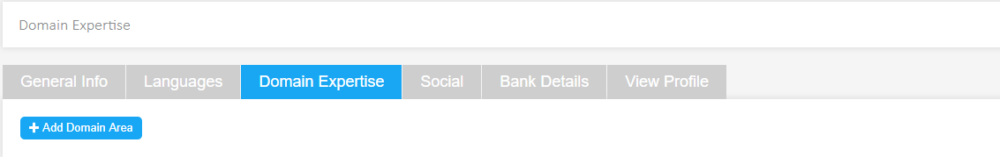
4. Social: User can link his social media platforms such as “Facebook”, “LinkedIn” to showcase in profile. Click on “Connect” button and add profile by logging with the credentials of that platform. Click “Save” button after completing the integration process.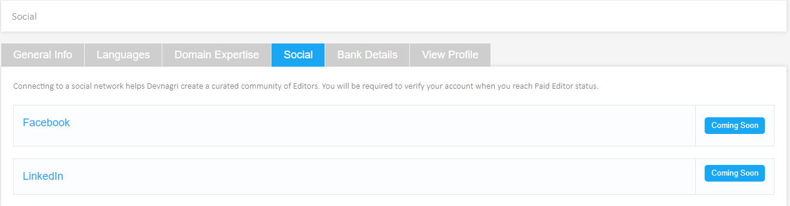
5. Bank Details: Add bank details carefully for successful payout of the projects complete. User require minimum of Rs. 500 balance to request for a payout. User can add more than one account and can set a default account. Also, an account details can be deleted using the option under “Actions”. Press “Save” button to store the preferences.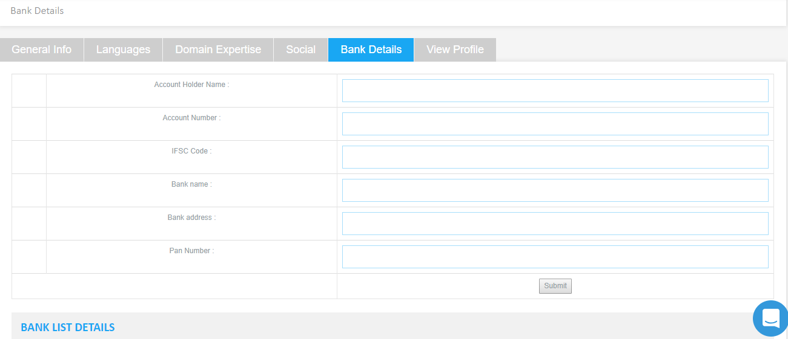
6. View Profile: User can view all the changes made and how it will be showcased in our community.

## Attempt Test

User will be required to attempt test in order to start with the projects in desired language and field.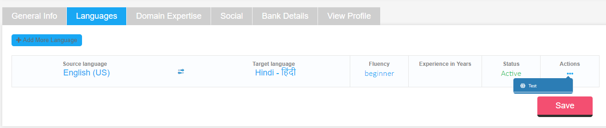

1. The option to attempt test will be available on the dashboard for the first time user. Click and start test to get “verified” tag
2. User will be required to attempt all questions.
3. On the basis of evaluation user will either be verified or would be required to take test again. In both the cases user will be notified via email and notification.

## Translation of the Project

As soon as the translator is assigned an order, he will be notified in “Notification” tab and also via Email on the registered email address. Click on the Order  ID name highlighting on the dashboard to start with the translation.

### Translation Screen

This screen will be showing every details for the translation to be appropriate, user will require to follow the steps as given below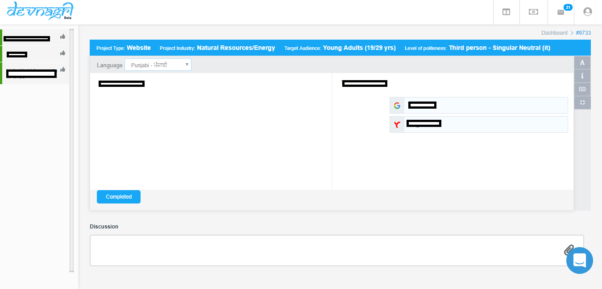

1. AT: The first option highlighting will be for the AT (Automatic Translation) giving the suggestions from top machine translation engines.

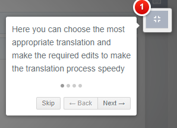

2. Sentences: On the left hand panel the complete set of sentences in the project will be displayed. The color shall notify the status of the sentences (Whether translated, accepted or rejected)

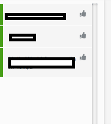

3. Title Bar: User shall get all the details about the Industry of the project, Targeted audience and level of politeness with which the sentences are to be converted.

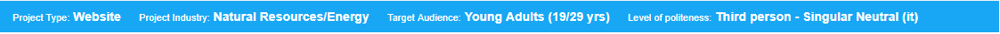

4. Language: This tab will show the language in which the sentence will be converted.

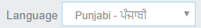

5. Action Button: Right hand of the message screen will be showing the options related to translation.

* A: Use can increase the size of the text according to his comfort, using this option.

* i: Any specific instruction by client will be displayed under this option. Click to expand and view the message

* Keyboard Shortcuts: This tab helps to note all the shortcuts which can be implemented on the tanslation screen and task could be speed up.

* AT: User can select/de-select AT option.

### Steps of Translation

1. Click the first message, AT suggestion will be coming at the right half of the screen
2. Check the converted message and edit or rephrase according to instructions and context
3. After this user will click the “Translate”, “Save & Next” to fix the changes, the sentence color will change on left panel confirming the change made.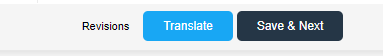
4. As soon as the last sentence is translated, a pop-up will show the message of order complete. Press “Ok” and click “Completed” option to report it from your end.
5. Dashboard will show the project, it will be showing the status as “Proofreading” for further confirmation.
