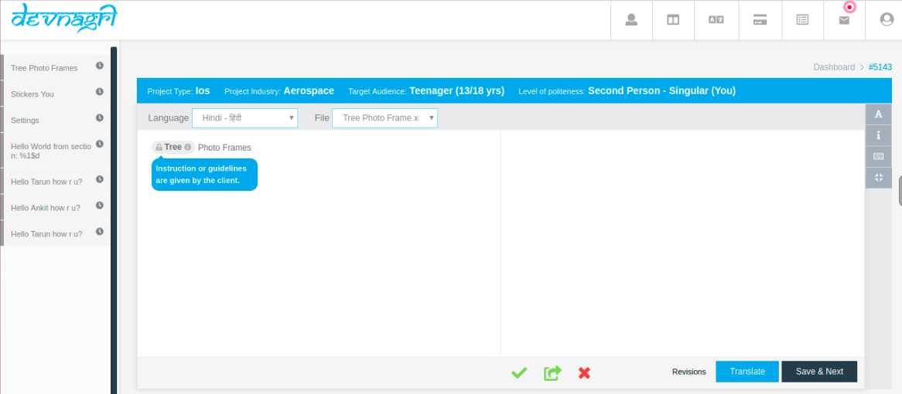
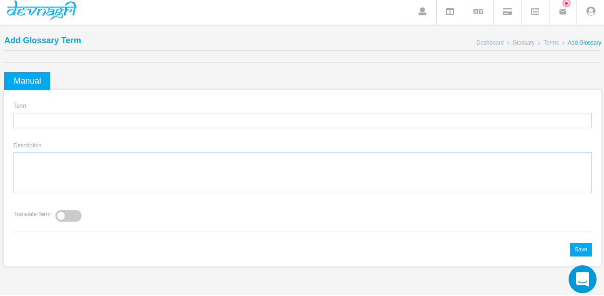

# Glossary

Glossaries are the definitions and meanings of specific sentences unique to your domain. In the translation process it will help translators to find those terms and apply correct translations. Which will eventually improve your translation speed & quality.

## Types of Glossary

1. Translate Term
2. Do not translate

## Translate Term

1. **Translate the term**: By using the option translate the term client should give the description that how the phrase get translate by giving some special guidelines.

   The instructions given by the client will displaying on translation page on mousehover on that particular phrase.

## Do not Translate

By using this option the phrase should be displayed highlighted on translation page with the message **Do Not Translate**

## How to Add Glossary

### Step 1: Go to Project

### Step 2: Go to Glossary tab

### Step 3: Click on Add Glossary Button

## Step 4: Glossary View

