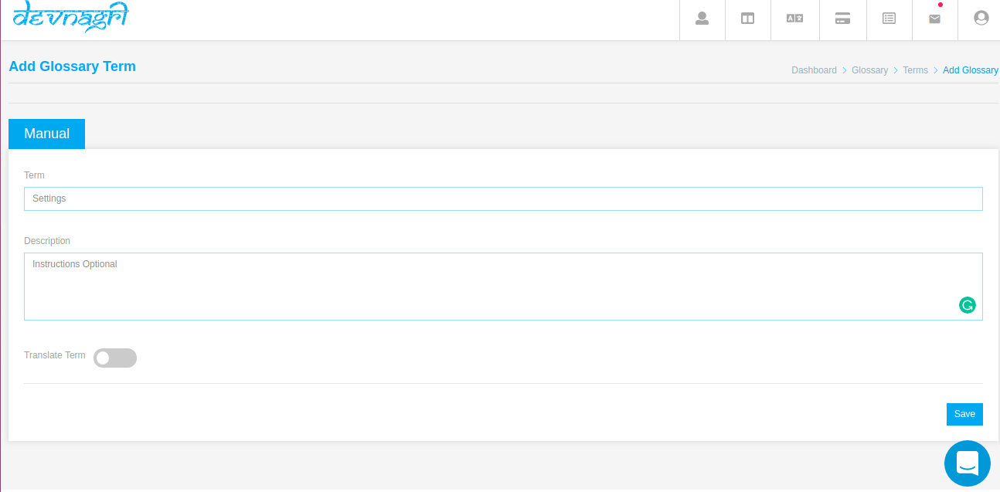

# Glossary

Glossaries are the definitions and meanings of specific sentences unique to your domain. In the translation process it will help translators to find those terms and apply correct translations. Which will eventually improve your translation speed & quality.

## Types of Glossary

1. Translate Term
2. Do not translate

## Translate Term

1. **Translate the term**: By using the option translate the term client should give the description that how the phrase get translate by giving some special guidelines.

## Do not Translate

By using this option the phrase should be displayed highlighted on translation page with the message **Do Not Translate**

## How to Add Glossary

### Step 1: Go to Order
### Step 2: Go to Glossary tab

### 

### Manual Glossary
i. Add the “Industry”, select according to the order and terminology

ii. “Term” add the term/word

iii.“Description” is used to add details for the term added. It helps if the translation is required but in a specialized way,

iv.“Translate Term” Select or Deselect; on selecting the option terminology will be translated according to the given instructions & on deselecting the word will remain untranslated. 

v. Use “Save” option to store the terms in glossary.

### Upload Glossary
i. To understand how to upload the terms in bulk user can “Download Sample File”. Add the term, description, and the status of translation in “Yes/No”

ii. After the information is added in the file and saved, choose the “Industry”.

iii. Upload the file by simple “drag and drop” or selecting the local file destination. 

iv. As soon as the file gets successfully uploaded select “Save” option.

