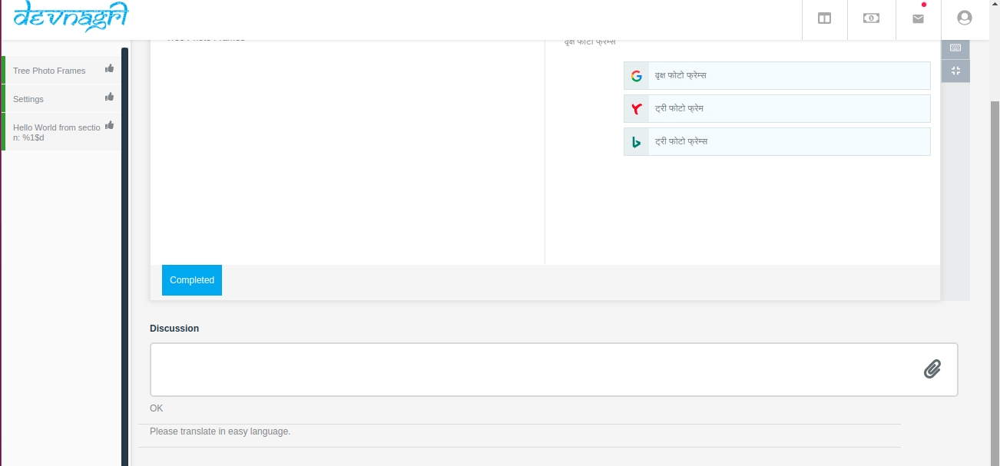
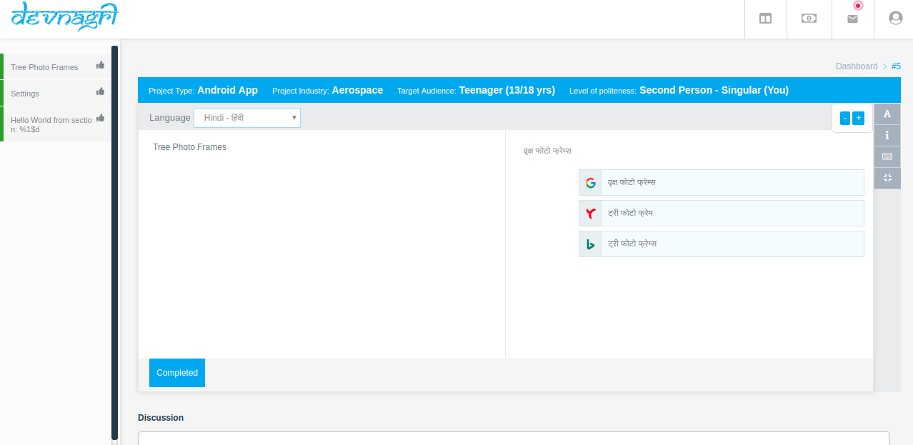
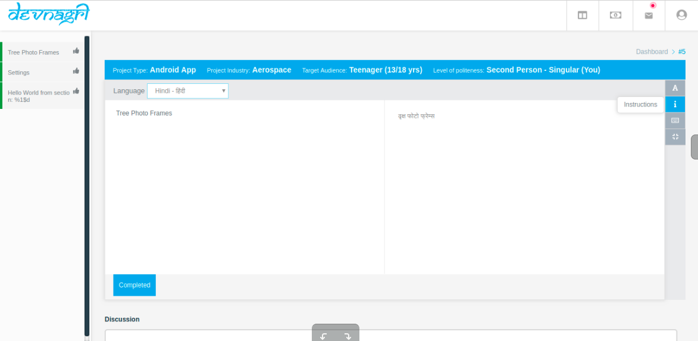
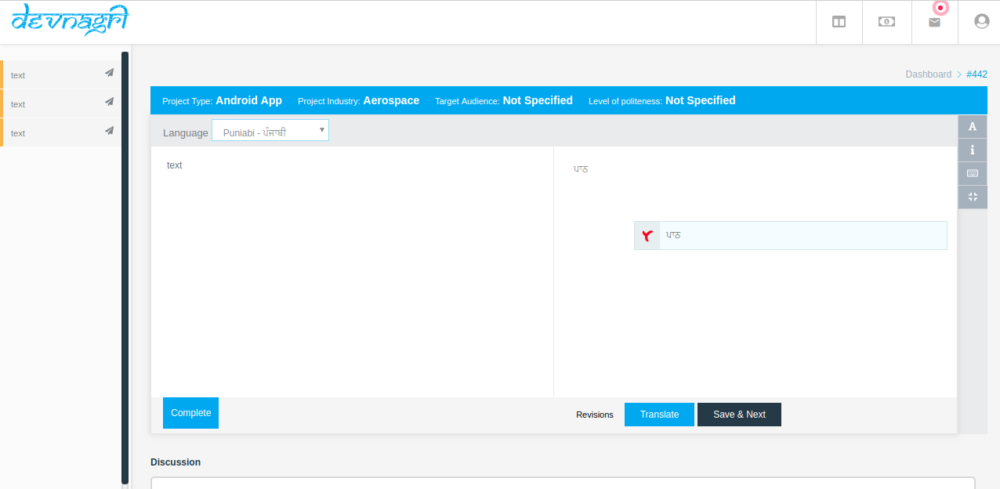
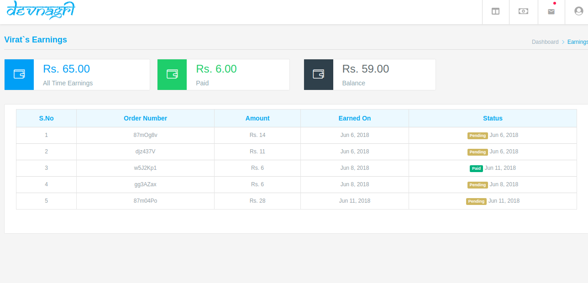

# **Translator**

## Login with Translator ID

  [Log in to the platform.](https://app.devnagri.com)

## Assigned Orders

 

  After Logging in, all the orders assign to the translator will be displayed on the dashboard screen.

   The status of new assigned orders is **"ToDo"**

  **Translation Page:**

On clicking that order you'll be redirected to the Translation Page.

**DISCUSSIONS:**

You can communicate and ask questions to Client or Reviewer by commenting on individual phrases at Discussion.

 or

Comment added by Client or Reviewer will be displayed on that individual phrase.

**Increase Text Size:**

You can increase or decrease the text size by using "+", "-" keys.

**Instruction Box:**

The instruction given by client regarding the translation of the project will be displayed in the "Instruction Box".

**Keyboard Shortcut:**

To see the keyboard shortcut controls you will have to click on "Keyboard Shortcut" label and then you can perform the action faster by using those shortcuts.

**Complete Translations:**

Once the translation is done then the complete button will appear and after clicking on the complete button the notification will be sent to client, reviewer & Manager that the translation has been completed.

## Earnings

All your earnings will be displayed on Earnings page.
