# Devnagri

Devnagri, an AI powered human translation platform is at the clientele service to help businesses reach the potentially huge client base in indian market. Below given is the useful manual that will help in understanding the functionalities of the system. User shall follow the steps to place the order for translation

## Getting Started With Devnagri

### Signing Up

User can [sign-up](https://app.devnagri.com/login), by filling the details required (such as Name, Company, Industry, Email ID, Mobile Number, Password) in the form given on the link. Once the complete details are filled, select “sign-up” option, a verification link will be emailed. Log in the registered email and click on the verification button to get account verified.
User can also sign-up using his/her LinkedIn, Google Plus or GitHub ID.

### Logging In

1. User can [login devnagri](https://app.devnagri.com/login) by using credentials (EMail ID & password) made during the sign-up process
2. User can also login using his/her social media (Linkedin, Google Plus or GitHub) credentials .
3. User can also login using “Magic Link” option, using it user shall enter the registered email ID in the given text box and a unique link shall be emailed on the same ID using which he/she can login directly.

### Password Recovery

If user has forgotten (or want to reset)  the registered password, then using [“Forgot Password”](https://app.devnagri.com/login) option given on login screen it can be renewed (or reset). Enter the registered Email ID, a reset password link will be emailed. Click on that link and enter new password. User will be notified on the successful change of the password

## User Dashboard

User dashboard holds all the information about the number of projects ordered, translation status, profile, bill etc.. Below given are the details for the use of different options.

### Navigation Panel

Navigation panel, available options are explained below;
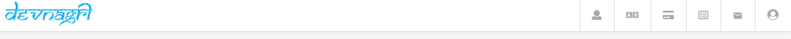

#### Profile

Top-right corner has a profile section that includes User Name and registered Email address below which there are:

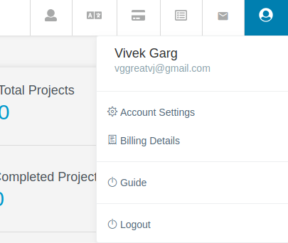

1. Account Settings

It holds different functionalities to improve personal profile, read details [here](#account settings)

2. Billing Details
Information such as Billing Address, GSTIN are stored here, [read more](#billing details)
<!--  -->
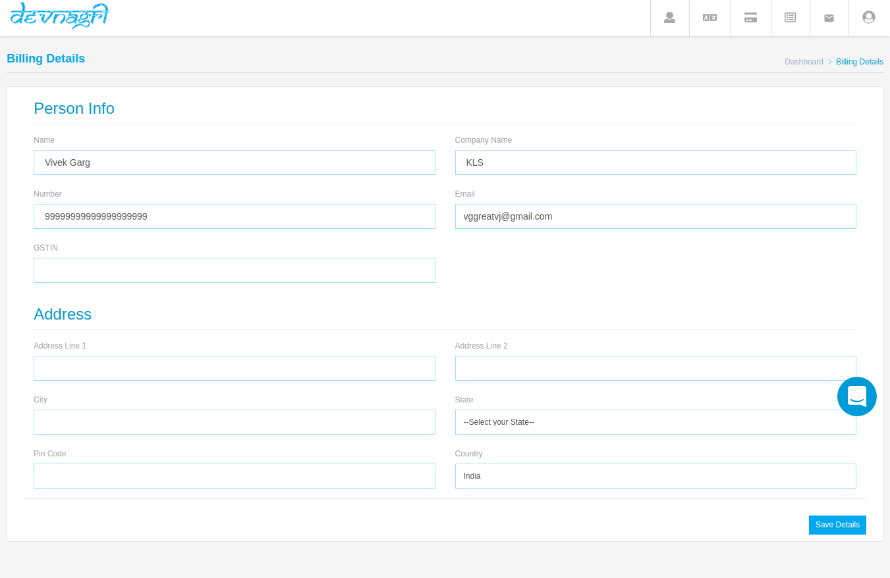
3. Guide
It opens default for first time user, this helps in knowing usage of different sections present in current screen of the user.

4. Logout
To end the current session user can use **Logout** option.

#### Notifications

This tab shall blink whenever any new event happens with the project. For example; when the translator submit the project for review.
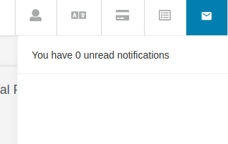

#### Orders

Using this menu user can check out all the orders (current and previous) along with payment status.
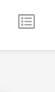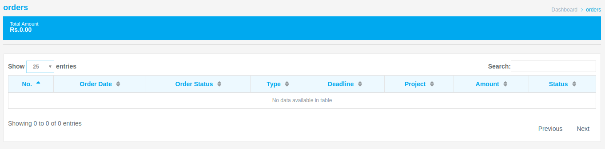

#### Transactions

It holds information about all the transactions made by user for the orders made. [Read details to check the earlier/current invoices](#invoice details)
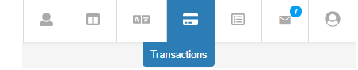

#### Translators

It holds information about the translators that user has added for translating the projects. [Read more about adding a translator](#translator)
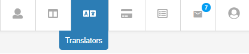

#### Projects

This option gives the information about all the projects, along with their current status. [Read more about projects](#projects)
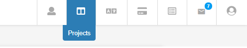

#### Dashboard

It will direct the user back to the main dashboard panel.
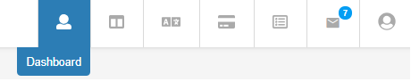

### Client Dashboard

#### Add Picture

User can add a profile photo for display purpose using this option. User can upload a file from local disk or can drag and drop the same.
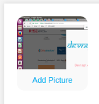 

#### AT Credits

Whenever user sign up a new account a default 500 credits are added to the balance. These credits help in Automated Translation (AT) for the project. 1 Credit = 25 words(for all-[services](#services)).
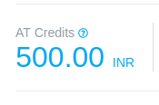

#### Translation Credits

This is a premium service wallet that will hold the balance amount for the user interested in getting a manual translator/Proof-reader for the project.

#### Buy Credits

Using this option, client will be able to buy [AT](#AT) credits in the account.

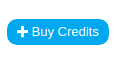

#### Total Projects

This option will let the user know the number of projects aligned by him. User can look for the details by clicking on the numeral value shown.
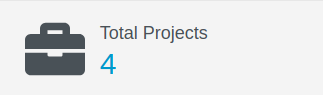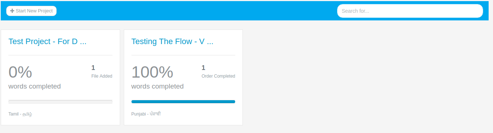

#### Completed Projects

All projects completed for the user through Devngari holds a reference value here, selecting this option will navigate the user on the page holding all the [completed project record](#project details).
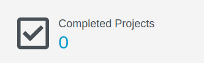

#### Active Projects

The number of projects in the pipeline by the user are numerically symbolised in this sections. By clicking on the number user shall be directed on the [active project page](#active project details).
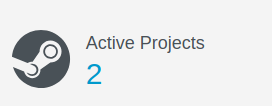

#### Add New Project

This allows user to add a new project for translation using Devnagri. [Read below to know more](#more about devnagri translation)

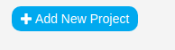

#### Support

Down right corner holds an option to have live chat support from the team devnagri regarding any doubt or concern over the usage of the platform or project order.
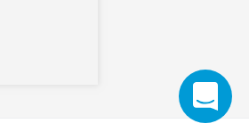

## Adding New Project

In user dashboard there is an option of “Add New Project” using this option a project can be added for translation. Details for placing the project are mentioned further.

### Project Description

Here, the user shall add the details regarding the project before adding the file or moving next step

#### Project Name

User will define the name of the project accordingly
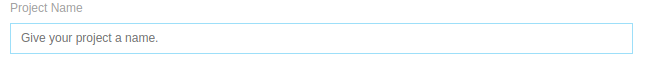

#### Platform

User will add the platform with which the project is related to. Eg; Android, iOS, Web, etc.
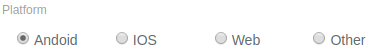

#### Industry

User shall define the type of industry with which the project is related to. There are pre defined industries, if user could not find the appropriate field then he can ask for help through the support section available

#### Audience

User can select the type of audience, depending upon the targeted age group
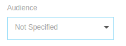

#### Level of Politeness

It contains the content pitch with which it has to be translated, whether in first person, second person or third person for the personalisation factor
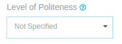

#### Source Language

This option will be used to define the source language of the content in which it is available with user.

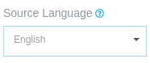

### Target Language

This option will be used to define the target (translating) language in which user require the content. (**Note**: user can select multiple languages for different language translations)

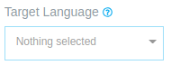

#### Instruction

User will add extra instruction (if any) which he wants to convey to the translator while opting for the premium translation services.

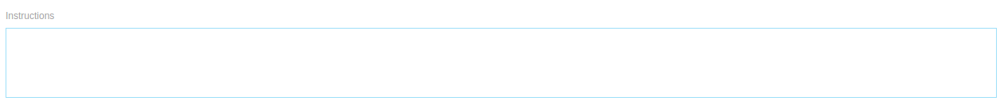

#### Cancel/Submit

User can either “Cancel” the current project or can use “Submit” option to move a step ahead with the project.

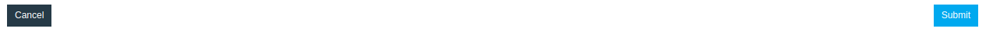

### Add File

When user selects the option of submit on the “Project Description” page, he is directed to “Add file” page. Here, the user will upload the file that requires translation.
There are multiple supported file formats given in the upload section. User can upload any of these extension files by selecting from the local machine or else by simple drag and drop from location to destination.

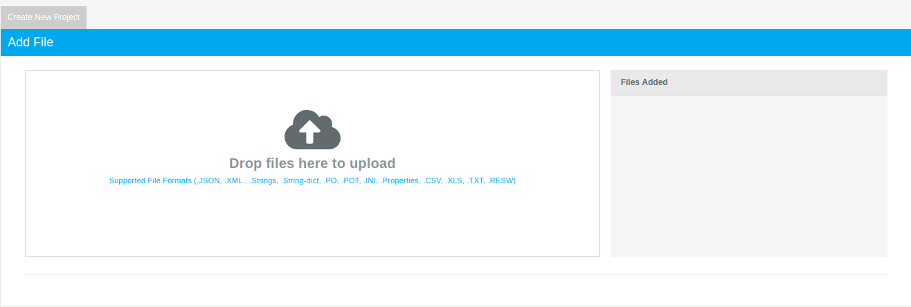

#### Files Added

This option will hold the number of files uploaded with their status “Supported”. **Note**: _Files except mentioned formats cannot be translated_.
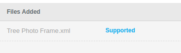

#### Upload

Using this option the selected file/files will be uploaded and the project will be created for translation.
Next screen will show the successful uploaded file message including the options for moving further. User can either “choose translation plan” for the project translation or can “go to dashboard” to upload another project.

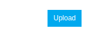

### Choose Translation Plan

In this section user will have three options to choose from and complete the project requirement order,

#### Self-Translation

Using this option user can translate the project on his own or via team of invited translators. [Read more about adding a translator](#Read)

#### Automated Translation

Choosing this option, will enable the user to get automated translations from multiple automated translation service providers. Word count and time slot will show the number of words for changes and the amount of time it will take. Quality of the translation will remain low as options like manual translation & proofread will remain locked for it. User can add proofread and manual translation service in this plan from the drag down option. After the finalization user will select the “Proceed Now” option given at the right-end corner of the page.

#### Premium Translation

Premium Translation option enables user to take the advantage of translation community present at Devnagri, in this translations are made using human and AI suggestions and the complete report is proofread by the language expert for 100% accuracy. This process takes brief amount of time. User can opt and move to “Proceed Now” option to get the project to next stage.

### Translation Order

Selecting “free translation” option will land the user to the project detail page. While other plans will open “Translation Order” page, the steps for other orders are given below:

#### Select All

If user has multiple files for the translation, this option can be used. If a particular file or files have to be ordered then deselect the option and select the required files manually under “Specific File” option.

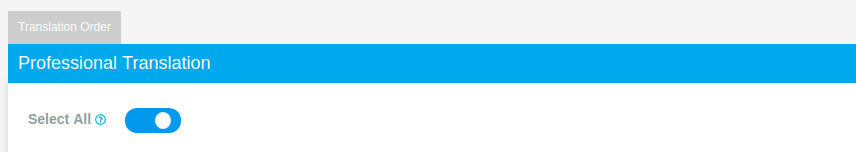

#### Specific File

If there are more than one files, user can choose this option to select a specific file for translation purpose. Read more for Non-Translated option.

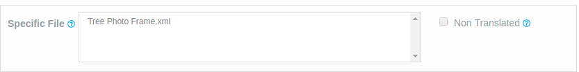

#### Date Range

If the remaining files of earlier project are to be translated then this date selection can be used. Or user can choose “All from Last Order” to include every non-translated file. (**Note**: This option is for the repeated order case)

#### Select Language

User can select single or multiple languages out of all the languages selected at the time of project description. This gives an opportunity to get the file translated according to the current requirement.

#### Try Proof-Reading

User can select this option to request a field expert to proof read the translated file. This option can be used in both “Automation Translation” and “Premium Translation”

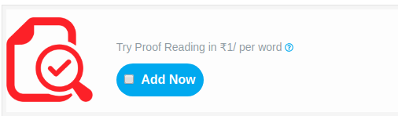

#### Summary

Complete billing details will appear under summary, user can proceed by “Confirm & Make Payment” option in the bottom-right end of the page or else “cancel” to make changes in the order. Once clicked on “Confirm and Make Payment” a success message will blink and user will be directed to the “Project Detail” section.

#### Confirm & Make Payment/Cancel

User can either confirm the order if everything selected is as per the requirement by using the option at bottom right or else can cancel the order by using the option given at the bottom left.

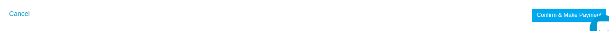

#### Order Successful

If user selects and confirm the payment, the order shall be placed and the process will be taken care of, by Team Devnagri.

## Tracking The Progress

1. User need to open the projects page under the dashboard

2. The project progress will be given in percentage for all on going projects.
3. Select a particular project and move to orders tab to know the exact progress levels

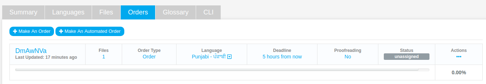
4. **Deadline**
It will show the time left in completing the project.
5. **Status**
It will show the progress at the level of Devnagri Management side. Whether project is unassigned, assigned, translated, proofread or completed.
6. **Actions**
Use “Action” option to either translate the project (if project is opted for AT or Free translation), or Download File (if the file is successfully translated) or else user can check the invoice of the project.
